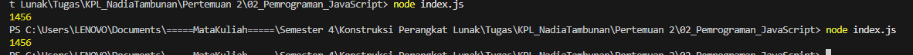

Soal

Kamu sudah menulis fungsi mulOfArray. Ujilah dengan input [2, 0, 26, 28, -2], dengan output yang seharusnya adalah 1456. Jika kamu menemukan bahwa hasilnya berbeda, bisakah kamu memperbaikinya? Jika kamu menemukan bahwa hasilnya sama, bisakah kamu menjelaskan mengapa demikian?

Output

Deskripsi Program

Mudahnya, cukup apus 0 nya aja soale 0 itu yang bikin hasilnya jadi 0. jadi saya ilangin 0 nya. selesaaai
