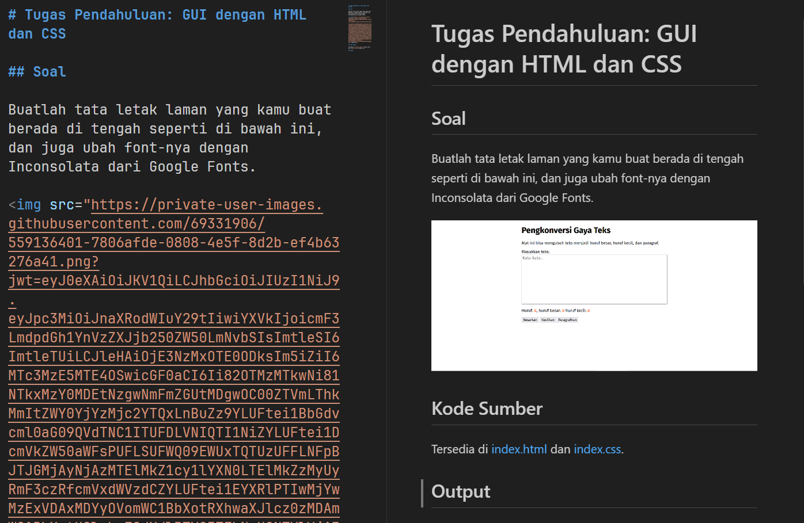

# Tugas Pendahuluan: Menulis Markdown

**Nama:** Yanti Caroline  
**NIM:** 2211105000  
**Kelas:** SE-08-00

## Tugas

Buatlah sebuah dokumen Markdown yang rapi dan sesuai tata letak.

Pastikan ada nama, NIM, dan kelas.

Pastikan ada Soal, Program/Kode (yang dipranalakan ke berkasnya), Output (berupa tangkapan layar), dan deskripsi tentang apa yang kamu lakukan dan mengapa itu bekerja?

Deskripsi boleh berisi proses pemikiran apa yang kamu terapkan untuk mencapai jawaban atas soal di atas.

Untuk judul di atas, gunakan satu pagar (`#`) diikuti dengan "[Jenis Tugas]: [Nama Modul Tanpa Nomor Modul]".

Untuk subbab (soal, program/kode, dsb.), gunakan dua pagar (`##`).

Output bisa berupa sebelum dan sesudah perubahan, langsung output, atau sekalian tambah anotasi.

Jika tugas menyertakan sebuah pertanyaan (seperti yang terdapat di Modul 2 Pemrograman JavaScript), jawaban bisa ditambahkan di bagian deskripsi.

## Program/Kode

Tersedia di [README.md](../README.md) dan [index.js](./index.js)

## Output

.

## Deskripsi

Markdown adalah berkas untuk menyimpan teks berformat, jadi ada kode sumber dan ada penampilnya.

Untuk menampilkan Markdown yang ditulis di Visual Studio Code, tekan `Ctrl+K` lalu tekan `V`.

Untuk menamba gambar, tangkap layar (_screenshot_), lalu `Ctrl+V` ke editan Markdown.
