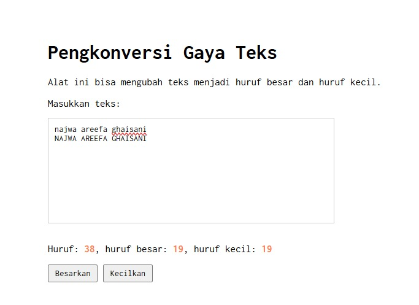

# Tugas Mandiri 03: GUI dengan HTML dan CSS

**Nama:** Nadia Tambunan
**NIM:** 103122400005
**Kelas:** SE-08-01

## Tugas

Setelah kamu menyelesaikan tugas pendahuluan (bisa buka di atas), terapkanlah fungsi untuk (1) menghitung huruf kecil yang disediakan di #hk, (2) mengubah huruf kecil ke huruf besar ketika pengguna menekan tombol #huruf-besar, dan (3) mengubah huruf besar ke huruf kecil ketika pengguna menekan tombol #huruf-kecil.

Kemudian, hapuslah fitur "Paragrafkan" dari alat.

NOTE: Asprak akan mereplikasi hasil tugas teman-teman apakah sesuai dengan harapan DAN apakah output, kode sumber, dan deskripsi sama sesuai.

## Kode Sumber

Tersedia di [index.html](./index.html) [index.css](./index.css) dan [index.js](./index.js)

## Output

## Deskripsi Program

Program ini tu bakalan bisa menghitung jumlah huruf yang diketik secara real-time, dimana setiap karakter bakalan dicek satu per satu. Kalau karakternya huruf kapital akan dihitung sebagai huruf besar, kalau huruf kecil dihitung sebagai huruf kecil, dan keduanya dihitung ke total huruf keseluruhan.

Selain itu, program ini juga juga punya tombol Besarkan untuk mengubah semua teks menjadi huruf kapital, dan tombol Kecilkan untuk mengubah semua teks menjadi huruf kecil.
