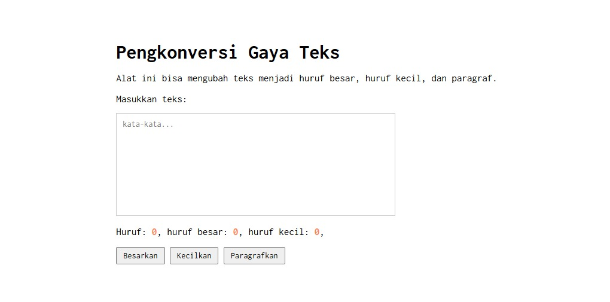

# Tugas Pendahuluan 03: GUI dengan HTML dan CSS

**Kode Sumber**
Tersedia di [index.hmtl](./index.html) [index.css](./index.css) dan [index.js](./index.js)

**Output**

**Deskripsi Program**

Pada program ini kita tu bakalan bisa menghitung dan mengkonversi gaya penulisan teks. Pokoknya dia tu bakal ngecek teks yang kita ketik satu per satu karakternya, kalau karakternya huruf kapital dia bakal dihitung sebagai huruf besar, kalau huruf kecil dihitung sebagai huruf kecil selain itu dia juga menghitung huruf yang kita ketik tu totalnya ada berapa.
