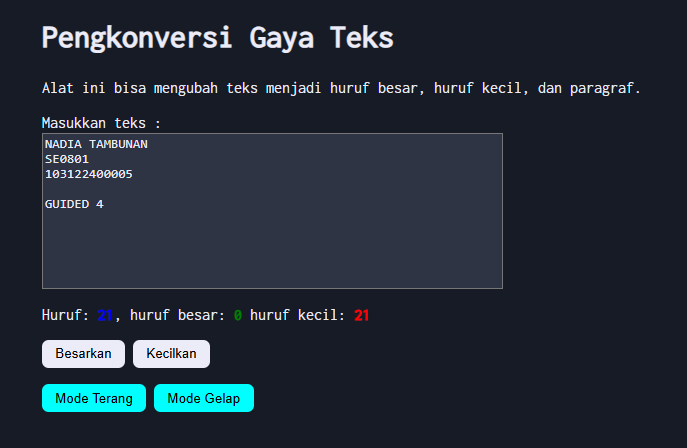

# Guided: Automata dan Table-Driven Construction

**Nama:** Nadia Tambunan
**NIM:** 103122400005  
**Kelas:** SE-08-01

## Program/Kode

Tersedia di [index.html](./index.html), [index.css](./index.css), [scripts.js](./scripts.js)

## Output

.

## Deskripsi

# Pengkonversi Gaya Teks (Text Style Converter)

Proyek ini adalah aplikasi web sederhana yang dirancang untuk membantu pengguna mengonversi format teks secara real-time. Fokus utama dari pengembangan ini adalah pada efisiensi logika manipulasi string dan pengalaman pengguna yang responsif.

## Deskripsi Proyek

Dalam pembuatan website ini, saya membangun struktur HTML yang mencakup area input teks, panel statistik karakter, dan tombol kontrol format.

Saya melakukan penataan visual menggunakan CSS dengan menerapkan metode Flexbox agar tampilan presisi di tengah layar, serta mengintegrasikan Google Fonts "Inconsolata" untuk memberikan kesan tipografi monospace yang modern dan bersih.

Untuk fungsionalitasnya, saya mengembangkan logika JavaScript yang mampu menghitung jumlah karakter, huruf besar, dan huruf kecil secara real-time menggunakan Regular Expression. Selain itu, aplikasi ini dilengkapi fitur pemilih mode (gelap dan terang) untuk kenyamanan visual pengguna.

Saya juga menyertakan fungsi transformasi teks yang memungkinkan pengguna mengubah format menjadi huruf kapital semua atau huruf kecil semua dengan sekali klik, sehingga proses penyuntingan teks menjadi lebih cepat dan efisien.
