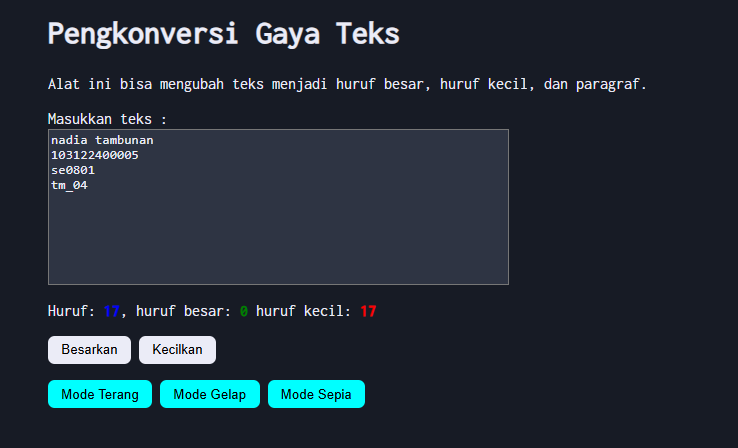

# Tugas Mandiri: Automata dan Table-Driven Construction

**Nama:** Nadia Tambunan
**NIM:** 103122400005  
**Kelas:** SE-08-01

## Program/Kode

Tersedia di [index.html](./index.html), [index.css](./index.css), [scripts.js](./scripts.js)

## Output

.

## Deskripsi

# Pengkonversi Gaya Teks (Text Style Converter)

Proyek ini merupakan aplikasi web ringkas yang ditujukan untuk memudahkan pengguna dalam mengubah format teks secara langsung tanpa jeda. Prioritas utama pengembangannya terletak pada optimasi logika pemrosesan string dan antarmuka yang responsif terhadap interaksi pengguna.

## Deskripsi Proyek

Dalam proses pembangunan website ini, saya menyusun kerangka HTML yang terdiri atas area masukan teks, panel informasi karakter, serta tombol-tombol pengatur format.

Tampilan visual ditata menggunakan CSS dengan memanfaatkan Flexbox guna menempatkan elemen secara presisi di tengah layar, sekaligus mengintegrasikan Google Fonts "Inconsolata" demi menghadirkan kesan tipografi monospace yang tampak modern dan rapi.

Dari sisi fungsionalitas, saya merancang logika JavaScript yang sanggup menghitung jumlah total karakter, huruf kapital, maupun huruf kecil secara langsung dengan memanfaatkan Regular Expression. Di samping itu, aplikasi ini turut menyediakan fitur pemilihan tema tampilan — gelap, terang, dan sepia — demi kenyamanan visual saat digunakan.

Saya pun menambahkan fungsi transformasi teks yang memberi kemudahan bagi pengguna untuk mengalihkan format tulisan menjadi seluruhnya huruf kapital atau seluruhnya huruf kecil hanya dengan satu klik, sehingga proses pengeditan teks dapat berlangsung lebih cepat dan efisien.
