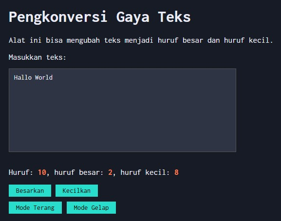

# Tugas Pendahuluan 04: Automata dan Table-Driven Construction

**Nama:** Nadia Tambunan
**NIM:** 103122400005  
**Kelas:** SE-08-01

## Tugas

Tambahkan mode gelap sekaligus untuk editor-kecil dan tombol-tombolnya. Ketentuan warna untuk latar belakang editor-kecil adalah #2e3443, sementara untuk tombol adalah #29ddcc. Teks untuk tombol tetap mengikuti warna teks sebelumnya.

Untuk menghapus pinggiran tombol, nyatakan properti border untuk tidak ditunjukkan.

## Kode Sumber

Tersedia di [index.html](./index.html) [index.css](./index.css) dan [index.js](./index.js)

## Output

## Deskripsi Program

Program ini adalah alat pengkonversi gaya teks pakai HTML, CSS, dan JavaScript. Pokoknya dia tu bakal ngecek teks yang kita ketik satu per satu karakternya, kalau karakternya huruf kapital dia bakal dihitung sebagai huruf besar, kalau huruf kecil dihitung sebagai huruf kecil, selain itu dia juga menghitung huruf yang kita ketik tu totalnya ada berapa. Terus ada juga tombol Besarkan buat ngubah semua teks jadi huruf kapital, dan tombol.

Selain itu dia juga punya fitur mode gelap, jadi kalau mau make di malam hari bisa klik tombol Mode Gelap biar tampilannya jadi gelap, dan klik Mode Terang buat balik lagi ke tampilan terang
