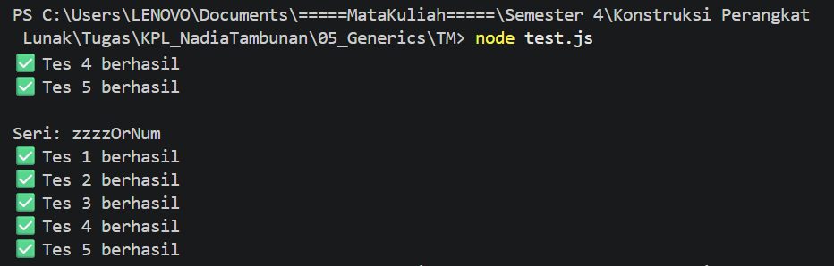

# Tugas Mandiri 05: Generic

**Nama:** Nadia Tambunan
**NIM:** 103122400005  
**Kelas:** SE-08-01

## Tugas

Diberikan program index.js seperti ini:

```
// Tambah JSDoc di sini
function zzzzOrNum(value) {
    // Ubah kode di sini
}

// Tambah JSDOC di sini
function fizzBuzz(sequence) {
    // Ubah kode di sini

    const newSequence = sequence.map((e) => zzzzOrNum(e));

    return newSequence;
}

module.exports = {
    fizzBuzz: fizzBuzz,
    zzzzOrNum: zzzzOrNum,
};
```

Ketentuan pengerjaan FizzBuzz:

Fungsi fizzBuzz menerima input berupa array berisi bilangan bulat dan menghasilkan array baru yang berisi kombinasi string dan angka.

Fungsi zzzzOrNum bertugas memproses satu data angka bulat untuk menentukan apakah outputnya berupa "Fizz", "Buzz", "FizzBuzz", atau angka itu sendiri.

Wajib menyertakan dokumentasi JSDoc pada kedua fungsi untuk mendefinisikan tipe data parameter dan return value sesuai aturan nomor 1 dan 2.

Implementasi fizzBuzz harus memanggil fungsi zzzzOrNum di dalamnya.

Gunakan konfigurasi pada tsconfig.json dan gunakan test.js untuk melakukan pengujian kode.

## Kode Sumber

Tersedia di [fizz.js](./fizz.js) dan [test.js](./test.js)

## Output



## Deskripsi Program

Program ini merupakan implementasi logika FizzBuzz menggunakan JavaScript yang dilengkapi dengan JSDoc sebagai alat bantu pengecekan tipe data (simulasi static typing). Alur program terbagi menjadi dua fungsi utama: zzzzOrNum yang berfungsi sebagai logika pengecekan angka tunggal, dan fizzBuzz yang berperan mengelola pemrosesan seluruh elemen di dalam array.

Logika utamanya didasarkan pada pemeriksaan kelipatan angka:

Jika angka merupakan kelipatan 3 dan 5, program akan menghasilkan FizzBuzz.

Jika angka hanya merupakan kelipatan 3, program akan menghasilkan Fizz.

Jika angka hanya merupakan kelipatan 5, program akan menghasilkan Buzz.

Jika tidak memenuhi kriteria di atas, angka akan dikembalikan dalam bentuk aslinya.
