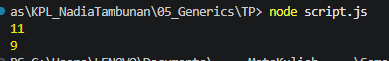

# Tugas Pendahuluan: Generics

**Nama:** Nadia Tambunan
**NIM:** 103122400005  
**Kelas:** SE-08-01

## Program/Kode

Tersedia di [scripts.js](./scripts.js)

## Output

.

Repositori ini berisi implementasi fungsi Generics sederhana menggunakan JavaScript sebagai bagian dari tugas Praktikum Konstruksi Perangkat Lunak (KPL).

## 📝 Deskripsi Kode

Pada modul ini, saya membuat sebuah fungsi JavaScript yang bertugas menghitung statistik teks dengan cara yang ringkas dan efisien. Inti dari kode ini adalah satu fungsi generik bernama hitung() — fungsi serbaguna yang dapat bekerja dalam dua mode berbeda, sehingga kode tidak perlu ditulis berulang dan program pun menjadi lebih andal. Fungsi ini dirancang agar fleksibel dalam memproses data teks sesuai kebutuhan pengguna. Ketika menggunakan mode "semua", fungsi akan menghitung seluruh karakter yang ada, termasuk spasi. Sementara itu, mode "huruf" memanfaatkan perintah continue untuk melewati spasi secara otomatis, sehingga hanya huruf murni yang terhitung — sesuai dengan prinsip Don't Repeat Yourself (DRY) yang mendorong penulisan kode yang bersih dan tidak redundan.
