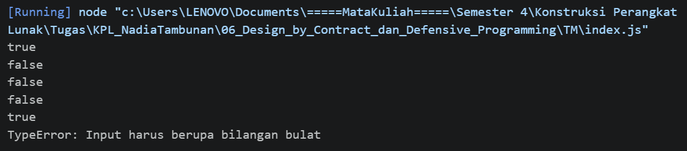

# Tugas Mandiri: Design by Contract dan Defensive Programming

**Nama:** Nadia Tambunan
**NIM:** 103122400005
**Kelas:** SE-08-01

## Program/Kode

Tersedia di [index.js](./index.js)

## Output

Pada tugas mandiri ini, aku menerapkan konsep Defensive Programming untuk membangun fungsi yang lebih robust terhadap input yang tidak valid. Tujuan utamanya adalah menyaring angka-angka yang termasuk kelipatan fizz buzz tanpa mengorbankan keakuratan tipe data yang diterima.

## 📝 Deskripsi Kode

Di tugas mandiri kali ini, aku nerapin konsep _Defensive Programming_ buat bikin fungsi yang "tahan banting" dari input yang nggak sesuai. Fokus utamanya adalah memfilter angka-angka kelipatan _fizz buzz_ sambil tetap menjaga integritas tipe data yang masuk.

Beberapa poin penting yang aku terapin di kode ini:

1. Validasi Input (Pre-condition): Digunakan `Number.isInteger()` untuk memastikan bahwa input benar-benar berupa bilangan bulat. Jika input berupa `null`, `NaN`, atau `Infinity`, maka program akan langsung melempar `TypeError`. Hal ini dilakukan agar fungsi tidak memproses data yang tidak valid.
2. **Mekanisme Filtering**: Fungsi akan mengembalikan nilai `false` jika angka yang diberikan merupakan kelipatan 3, 5, atau 15 (dengan memanfaatkan operator modulo `%`). Sebaliknya, jika angka tersebut bukan kelipatan dari nilai-nilai tersebut, fungsi akan menghasilkan `true`.
3. **Penanganan Error**: Pemanggilan fungsi dibungkus dalam blok `try-catch` agar ketika terjadi kesalahan akibat input yang tidak sesuai, program tidak berhenti secara tiba-tiba, melainkan menampilkan pesan error yang informatif di konsol.

ecara ringkas, kode ini dibuat untuk menolak input yang tidak valid sejak awal sebelum diproses lebih lanjut oleh logika utama.
