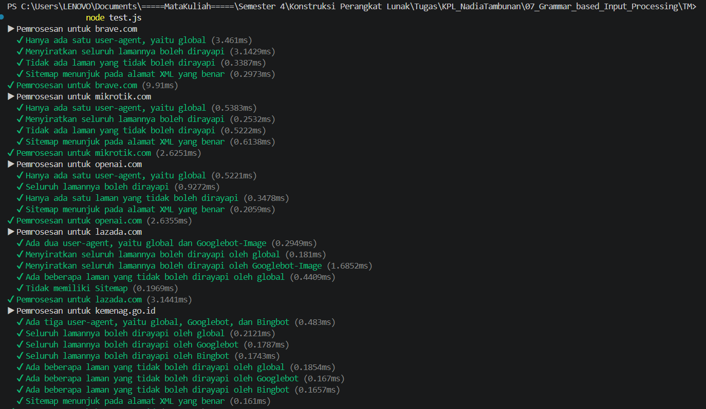
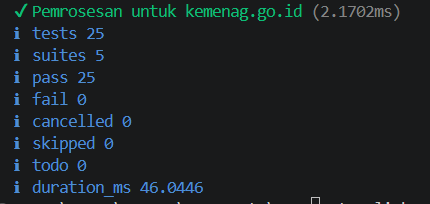

# Tugas Mandiri: Grammar-based Input Processing

**Nama:** Nadia Tambunan
**NIM:** 103122400005
**Kelas:** SE-08-01

## Program/Kode

Tersedia di [index.js](./index.js)

## Output

Repositori ini memuat implementasi fungsi **Grammar-based Input Processing** menggunakan JavaScript untuk menyelesaikan tugas Praktikum Konstruksi Perangkat Lunak (KPL) Modul 7.

## 📝 Penjelasan Kode

Pada modul ini, fokus utamanya adalah bagaimana melakukan proses _parsing_ atau pengolahan input teks agar dapat diubah menjadi struktur data yang lebih terorganisir. Dalam implementasi ini, aku membuat fungsi `parseRobots` (sebagai parser untuk file robots.txt) yang bertugas mengonversi teks mentah menjadi objek JavaScript yang terstruktur.

Pendekatan yang digunakan dalam kode ini cukup sederhana namun tetap efektif, sesuai dengan materi pada Modul 7:

1. **Pemecahan Baris:** Menggunakan `.split('\n')` untuk membagi teks panjang menjadi beberapa baris agar dapat diproses satu per satu.
2. **Manajemen State:** Memanfaatkan variabel bantu untuk melacak `User-agent` yang sedang aktif, sehingga aturan `Allow` dan `Disallow` berikutnya dapat dikaitkan dengan benar.
3. **Pembersihan Input:** Menggunakan `.trim()` untuk menghapus spasi berlebih serta pengecekan `.startsWith('#')` untuk mengabaikan baris komentar.
4. **Transformasi Data:** Mengubah bagian kunci menjadi _lowercase_ agar konsisten, sambil tetap mempertahankan struktur properti seperti `Allow`, `Disallow`, dan `Sitemap` sesuai kebutuhan pengujian.

Tujuan dari implementasi ini adalah agar program mampu memahami dan menginterpretasikan aturan akses bot pada sebuah website secara otomatis tanpa perlu membaca teks secara manual satu per satu.
