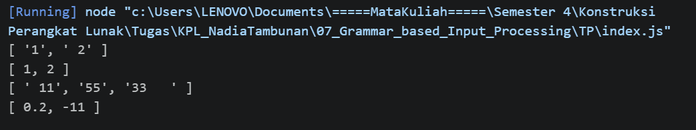

# Tugas Pendahuluan: Grammar-based Input Processing

**Nama:** Nadia Tambunan
**NIM:** 103122400005
**Kelas:** SE-08-01

## Program/Kode

Tersedia di [index.js](./index.js)

## Output

Repositori ini memuat implementasi fungsi **Grammar-based Input Processing** menggunakan JavaScript untuk menyelesaikan tugas Praktikum Konstruksi Perangkat Lunak (KPL) Modul 7.

## 📝 Penjelasan Kode

Pada modul ini, fokus utamanya adalah bagaimana melakukan proses _parsing_ atau pengolahan input berbentuk teks agar dapat diubah menjadi struktur data yang diinginkan. Dalam implementasi ini, aku membuat fungsi `toNumberArray` yang berfungsi untuk mengonversi sekumpulan string menjadi array berisi angka.

Pendekatan yang digunakan dalam kode ini cukup sederhana namun tetap efektif, sesuai dengan konsep yang dipelajari di Modul 7:

1. **Memisahkan String:** Menggunakan metode `.split(',')` untuk memecah angka-angka yang awalnya tergabung dalam satu string.
2. **Membersihkan Input:** Untuk menghindari kesalahan saat konversi, digunakan `.trim()` guna menghapus spasi berlebih di awal maupun akhir teks.
3. **Penyaringan Data:** Ditambahkan validasi menggunakan `isNaN` untuk memastikan hanya nilai numerik yang diproses. Jika terdapat input yang tidak valid (misalnya teks seperti 'abc'), maka nilai tersebut akan diabaikan.

Tujuan dari pendekatan ini adalah agar program tetap berjalan dengan baik meskipun menerima input yang tidak rapi atau tidak konsisten.
