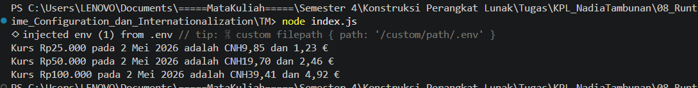

# Tugas Mandiri 08: Runtime Congfiguration dan Internationaliztion

**Nama:** Nadia Tambunan
**NIM:** 103122400005  
**Kelas:** SE-08-01

## Tugas

Pada tugas ini kamu akan membuat program yang menampilkan kurs rupiah (IDR) terhadap renminbi luar Tiongkok (CNH) dan euro (EUR). Gunakan [link API ini](./https://cdn.jsdelivr.net/npm/@fawazahmed0/currency-api@latest/v1/currencies/idr.json) untuk mengambil data.

Tantangan

1. Simpanlah URL API ke dalam `.env` sebagai `BASE_API`
2. Gunakan `Intl` untuk memformat nilai mata uang dan waktu kamu mengambil data kurs.
3. Hapus pesan promosi `dotenv`

Ujilah dengan Rp25000, Rp50000, dan Rp100000.

## Kode Sumber

Tersedia di [index.js](./index.js)

## Output

## Deskripsi Program

Fitur dan Alur Kerja

1. Konfigurasi Runtime: Menggunakan `dotenv` untuk memuat URL API dari variabel lingkungan.
2. Data Fetching: Fungsi asinkron `ambilData()` mengambil data kurs mata uang real-time dalam format JSON.
3. Internationalization (i18n): Mengimplementasikan `Intl.DateTimeFormat` untuk menyajikan tanggal dalam format lokal Indonesia.
4. Logika Konversi: Mengonversi IDR ke CNH dan EUR dengan pembulatan dua angka di belakang koma.
5. Automated Testing: Program menyertakan eksekusi otomatis untuk beberapa sampel data sekaligus guna memverifikasi akurasi hasil konversi.
