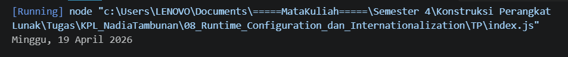

# Tugas Pendahuluan: Runtime Configuration dan Internationalization

**Nama:** Nadia Tambunan  
**NIM:** 103122400005  
**Kelas:** SE-08-01

## Program/Kode

Tersedia di [index.js](./index.js)

## Output

## 📝 Jawaban Tugas Pendahuluan

Pada Tugas Pendahuluan kali ini, fokus utamanya adalah menampilkan waktu saat ini dengan format bahasa Indonesia yang baku menggunakan fitur bawaan JavaScript.

### Implementasi Intl.DateTimeFormat

Untuk menghasilkan format tanggal **"Sabtu, 18 April 2026"**, saya menggunakan objek `Intl.DateTimeFormat` daripada melakukan manipulasi string manual. Hal ini memastikan:

1. **Lokalisasi tepat:** Menggunakan locale `id-ID` sehingga nama hari dan bulan otomatis dalam Bahasa Indonesia.
2. **Fleksibilitas:** Memudahkan pengaturan format (apakah bulan ingin tampil penuh/`long` atau angka/`numeric`).

### Manipulasi Tanggal (Date Manipulation)

Selain menampilkan tanggal sekarang, modul ini juga menekankan pada logika pengolahan waktu. Untuk mendapatkan tanggal di waktu yang berbeda (seperti besok atau kemarin), saya menerapkan metode:

- `getDate()`: Mengambil angka tanggal saat ini.
- `setDate()`: Menentukan angka tanggal baru dengan menambahkan atau mengurangi selisih hari.

### Analisis Runtime

Dalam konteks _Runtime Configuration dan Internationalization_, penggunaan `Intl` dan pola `Date` merupakan bentuk pengenalan aturan (_rules_) dalam penyajian informasi. Kode yang dibuat memastikan bahwa input mentah dari sistem (`new Date()`) diproses sedemikian rupa melalui _formatter_ agar menghasilkan output yang sesuai dengan tata bahasa yang diinginkan.
