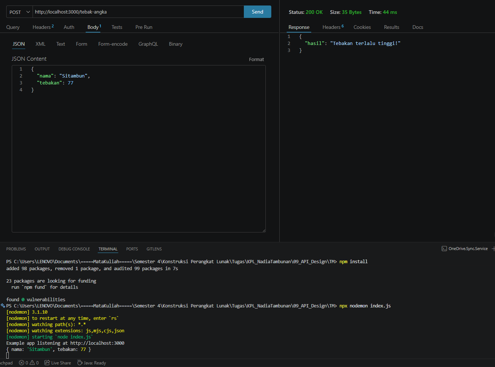

# Tugas Pendahuluan 09: API Design dan Construction Using Swagger

**Nama:** Nadia Tambunan  
**NIM:** 103122400005  
**Kelas:** SE-08-01

## Tugas

Mari kita main tebak-tebakan angka acak!

Tugasmu adalah membuat API yang terdiri dari satu endpoint saja, yaitu POST /. Ketika kita melakkukan POST, formatnya adalah seperti yang sudah diberikan.

Beberapa aturan:

1. Angka acak yang dihasilkan harus tetap dan tidak boleh berubah setiap kali permintaan API dilakukan, tetapi boleh berubah setiap harinya atau dibuat tetap selamanya
2. Rentang harus di antara 1-100
3. Nama harus sensitif terhadap besar kecil huruf (mis. hamid dan Hamid akan menghasilkan angka acak yang berbeda)
4. Tidak menggunakan pustaka apapun, murni mengandalkan nama dan tebakan

Penjelasan untuk nomor 1: Jika namanya Hamid, ia akan diharapkan tetap pada nilai tebakan 24 mau kamu melakukan 100 kali permintaan. Tidak ada jawaban benar di sini (Hamid tidak harus 24, bebas mau dibuat acak seperti apa yang penting harus tetap).

## Kode Sumber

Tersedia di [index.js](./index.js)

## Output

## Deskripsi Program

Fitur: Alur Kerja Tebak Angka

- Input Data: Server menerima request POST berisi JSON nama dan angka tebakan.
- Algoritma Angka Rahasia: Jawaban benar ditentukan dari total nilai ASCII karakter nama yang di-modulo 100 dan ditambah 1. Ini memastikan setiap nama memiliki angka unik yang tetap.
- Logika Validasi:
  - Jika tebakan < target: "Tebakan terlalu rendah!"
  - Jika tebakan > target: "Tebakan terlalu tinggi!"
  - Jika tebakan == target: "Benar sekali yey!" (Menampilkan angka yang benar).
- Contoh Kasus: Input nama "Areefa" secara otomatis menetapkan angka 81 sebagai jawaban benar.
