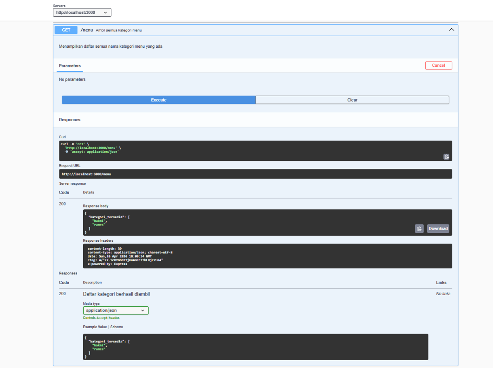
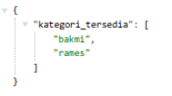

# Tugas Pendahuluan 09: API Design dan Construction Using Swagger

**Nama:** Nadia Tambunan  
**NIM:** 103122400005  
**Kelas:** SE-08-01

## Tugas

Buatlah satu endpoint lagi beserta dokumentasi OpenAPI-nya, yaitu GET /menu yang menampilkan daftar semua nama kategori menu yang ada.

## Kode Sumber

Tersedia di [index.js](./index.js)

## Output

## Deskripsi Program

Program ini adalah sebuah API sederhana yang dibuat pakai Node.js dan Express. API ini punya satu fitur utama, yaitu menampilkan daftar kategori menu yang tersedia lewat endpoint GET /menu. Jadi kalau kita akses alamat localhost:3000/menu di browser, kita bakal langsung lihat daftar kategori menu dalam format JSON, yaitu "bakmi" dan "rames".
