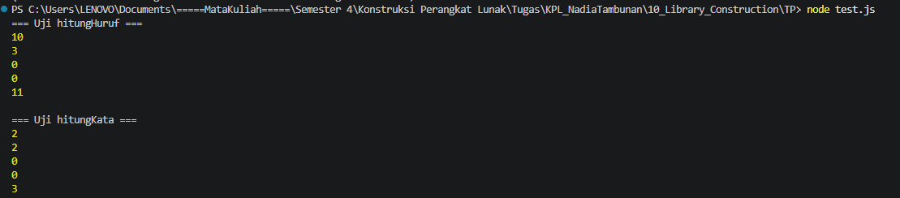

# Tugas Pendahuluan 10

Nama: Nadia Tambunan
NIM: 103122400005
Kelas: SE-08-01

**Soal**

Buatlah pustaka JavaScript yang menyediakan utilitas berupa dua fungsi yang menghitung jumlah huruf dan jumlah kata.

Kriteria:

Hanya alfabet A hingga Z yang dihitung (besar dan kecil)
Spasi tidak dihitung
Pustaka bisa diimpor

**Kode sumber**

Tersedia di [index.js](./index.js)

**Output**

**Penjelasan**

Logika dan Implementasi Program

- Struktur Modul: Program didefinisikan sebagai modul ekspor agar fungsi-fungsinya dapat diintegrasikan ke dalam file pengujian atau aplikasi yang lebih luas.
- Fungsi hitungHuruf: Menggunakan regex /[a-zA-Z]/g untuk memfilter dan menghitung total seluruh karakter alfabet secara individual dalam sebuah teks.
- Fungsi hitungKata: Menggunakan regex /[a-zA-Z]+/g untuk mengidentifikasi urutan karakter alfabet yang berurutan sebagai satu kesatuan kata.
- Kriteria Filter: Sesuai instruksi, program secara otomatis mengabaikan spasi dan karakter selain huruf A-Z selama proses perhitungan berlangsung.
