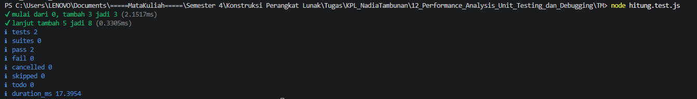

# Tugas Pendahuluan 12: Performance Analysis Unit Testing dan Debugging

**Nama:** Nadia Tambunan  
**NIM:** 103122400005  
**Kelas:** SE-08-01

## Tugas

Fungsi di bawah ini melakukan penjumlaha pada penghitung (counter), yang sesederhana menambahk jumlah jika kamu menekan tombol.

`hitung.js`

```
function tambahPengitung(terkini, jumlah) {
  terkini = terkini + jumlah;
  return terkini;
}
```

dan `hitung.test.js`

```
import { test } from 'node:test';
import assert from 'node:assert';
import { tambahPengitung } from './hitung.js';

test('5 tambah 3 sama dengan 8', () => {
  assert.strictEqual(tambahPengitung(5, 3), 8);
});

test('0 tambah 10 sama dengan 10', () => {
  assert.strictEqual(tambahPengitung(0, 10), 10);
});
```

Bisakah kamu tunjukkan apakah kode sudah benar atau bagian mana yang perlu diperbaiki beserta alasannya?

## Kode Sumber

Tersedia di [hitung.js](./hitung.js) dan [hitung.test.js](./hitung.test.js)

## Output



## Deskripsi Program

Kode aslinya sebenernya udah bisa lulus test karena return value-nya bener, tapi ada masalah konseptual yang fungsinya nggak beneran nyimpen state counternya. Variabel `terkini` cuma hidup di dalam fungsi aja, jadi nilainya nggak keingat antar pemanggilan.

jadi solusinya, aku tambahin variabel `hitungan` di luar fungsi supaya state-nya persistent, dan tambahin juga fungsi `reset()` supaya counter bisa dikembaliin ke nol, ini penting buat testing biar setiap test case mulai dari kondisi yang bersih. Parameter fungsi juga disederhanain jadi cuma nerima `jumlah` aja, karena nilai saat ini udah otomatis diambil dari variabel `hitungan` yang ada di luar. Dengan begitu, setiap kali fungsinya dipanggil, counter-nya beneran nambah dari nilai sebelumnya, bukan mulai dari nol lagi.
