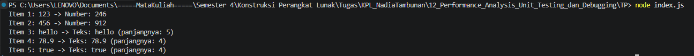

# Tugas Pendahuluan 12: Performance Analysis Unit Testing dan Debungging

**Nama:** Nadia Tambunan  
**NIM:** 103122400005  
**Kelas:** SE-08-01

## Tugas

Cobalah untuk menangkap kecacatan dalam kode ini

```
function main() {
  const data = [
    "123",
    456,
    "hello",
    78.9,
    true,
  ];

  for (let i = 0; i < data.length; i++) {
    const result = processData(data[i]);
    console.log(`Item ${i + 1}: ${data[i]} -> ${result}`);
  }
}

function processData(data) {
  const str = data.toLowerCase();
  const num = parseInt(str);
  if (!isNaN(num) && str === String(num)) {
    return `Number: ${num * 2}`;
  }
  return `Teks: ${str} (panjangnya: ${str.length})`;
}

main();

```

## Kode Sumber

Tersedia di [index.js](./index.js)

## Output



## Deskripsi Program

Pembaruan kode ini bertujuan menangani kegagalan sistem pada versi sebelumnya dengan menyelipkan fungsi `.toString()` tepat sebelum `.toLowerCase()`. Bug pada kode terdahulu menyebabkan program crash saat menemui input non-string (seperti `456`, `78.9`, atau `true`) karena keterbatasan method `.toLowerCase()`. Dengan mengubah seluruh input menjadi string terlebih dahulu lewat `data.toString()`, penanganan data di dalam array kini menjadi lebih kokoh, error-resistant, dan dapat diproses sepenuhnya tanpa kendala.
